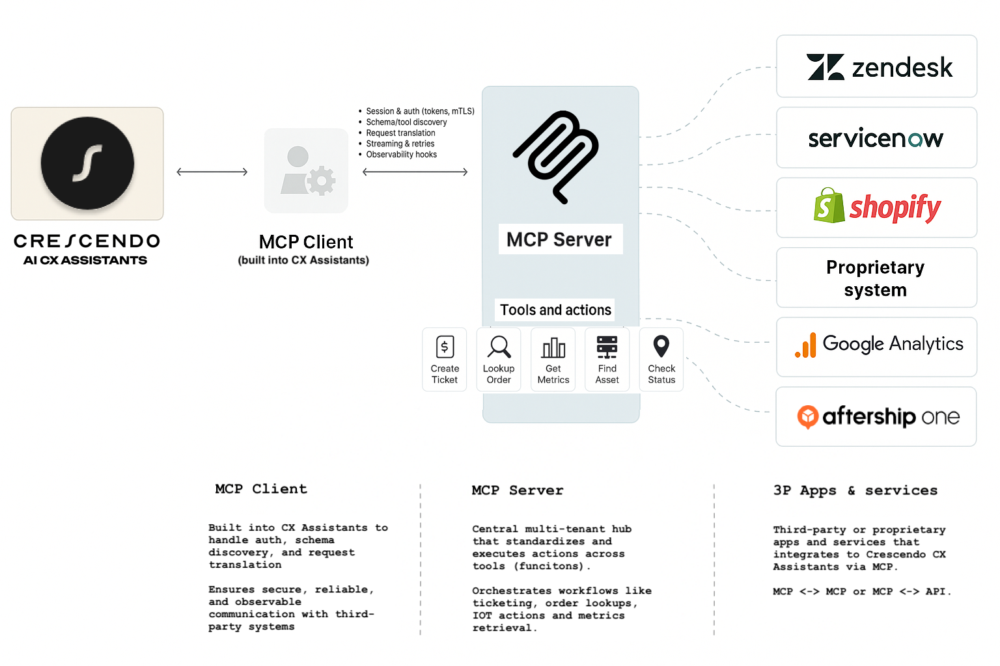

# AfterShip MCP for Claude Desktop

Local [Model Context Protocol (MCP)](https://modelcontextprotocol.io) server that lets **Claude Desktop** call the AfterShip API via two tools:

- **`list-couriers`** – list available couriers
- **`track-shipment`** – track a package by tracking number (with optional courier slug; falls back to detection)

---

## Architecture (diagram)



---

## How it works

```mermaid
graph TD
  A[Claude Desktop<br/>Chat UI] --> B[MCP Client]
  subgraph S[Local MCP Server (this repo)]
    B -->|JSON-RPC over stdio| C[@modelcontextprotocol/sdk Server]
    C --> D[Tools<br/>• list-couriers<br/>• track-shipment]
    D --> E[AfterShip Utils<br/>(axios)]
  end
  E -->|HTTPS| F[AfterShip REST API]
  F --> E --> D --> C -->|JSON-RPC| B --> A
```

---

## Requirements

- **Node.js 18+** (tested on Node 22)
- **Claude Desktop** (MCP enabled)
- **AfterShip API key**

---

## Install

```bash
npm i
```

> The project uses **ESM** (`"type": "module"`) and **TypeScript** (`tsx` runner).

---

## Configure Claude Desktop

Open **Claude Desktop → Settings → Developer → Edit Config**, and add an MCP server entry:

```json
{
  "mcpServers": {
    "aftership-tracking": {
      "command": "npx",
      "args": ["-y", "tsx", "/absolute/path/to/repo/src/index.ts"],
      "env": {
        "AFTERSHIP_API_KEY": "YOUR_AFTERSHIP_API_KEY"
      }
    }
  }
}
```

> 🔐 **Do not commit secrets.** If this repo is shared, prefer:
> ```json
> "AFTERSHIP_API_KEY": "$AFTERSHIP_API_KEY"
> ```
> and set the variable in your shell / system keychain.

Now **quit & reopen Claude Desktop** (Cmd–Q on macOS) so it picks up the config.

---

## Use in Claude

In any chat:

- **List couriers**
  > *Run the `list-couriers` tool (aftership-tracking).*

- **Track a shipment (known courier)**
  ```
  Run "track-shipment" (aftership-tracking) with:
  { "trackingNumber": "1Z999AA10123456784", "slug": "ups" }
  ```

- **Track a shipment (detect courier automatically)**
  ```
  Run "track-shipment" (aftership-tracking) with:
  { "trackingNumber": "1Z999AA10123456784" }
  ```

Claude will invoke the MCP tool and show results.

---

## Project structure

```
src/
  index.ts                     # MCP stdio server (tools/list & tools/call)
  tools/
    list-couriers.ts           # Tool wrapper (calls utils.listCouriers)
    track-shipment.ts          # Tool: detect → fetch → create → return
  utils/
    aftership-api.ts           # axios client + helpers (detect/get/create/list)
package.json
tsconfig.json
```

---

## Implementation notes

- **MCP transport**: stdio (stdin/stdout). The server uses `@modelcontextprotocol/sdk` **1.18.x**.
  - Tools are advertised via **`ListToolsRequestSchema`**, invoked via **`CallToolRequestSchema`** (imported from `@modelcontextprotocol/sdk/types.js`).
  - Server capabilities include `{ tools: { list: true, call: true } }`.

- **Do not log to stdout.**
  - `stdout` must carry **only** JSON-RPC.  
  - Use `console.error(...)` (stderr) for diagnostics; otherwise Claude will show “not valid JSON” errors.

- **Schemas (JSON Schema)**:
  - `list-couriers`: `{ "type": "object", "properties": {}, "additionalProperties": false }`
  - `track-shipment`:
    ```json
    {
      "type": "object",
      "properties": {
        "trackingNumber": { "type": "string" },
        "slug": { "type": "string", "nullable": true }
      },
      "required": ["trackingNumber"],
      "additionalProperties": false
    }
    ```

- **Tracking logic** (tool `track-shipment`):
  1. If `slug` is not provided → call `/couriers/detect`.
  2. Try `GET /trackings/{slug}/{tracking_number}` for top candidates.
  3. If none exists, `POST /trackings` to create one.
  4. Return a clear status (`ok`, `created`, `no_courier_detected`, `error`) and surface helpful messages from AfterShip.

- **TypeScript / ESM**:
  - Use explicit **`.ts`** extensions in relative imports (ESM rule).
  - `tsconfig.json` sets `"module": "ESNext"`, `"moduleResolution": "NodeNext"`.

---

## Local development

You can run the server without Claude (it will wait on stdio):

```bash
export AFTERSHIP_API_KEY=YOUR_AFTERSHIP_API_KEY  # local only
npx tsx src/index.ts
```

Claude Desktop logs (macOS): `~/Library/Logs/Claude/`  
- `mcp-server-aftership-tracking.log` – your server’s stderr/stdout (stderr recommended)  
- `mcp.log` – client/handshake logs

---

## Troubleshooting

- **No wrench / tools not visible**
  - Restart Claude Desktop after editing config.
  - Confirm `tools/list` returns both tools **with `inputSchema`**.
  - Capabilities must include `{ tools: { list: true, call: true } }`.

- **“not valid JSON” banner**
  - You printed to **stdout**. Switch to `console.error` (stderr).

- **400s from AfterShip**
  - Often caused by missing/invalid slug or an unrecognized number.
  - Use detection; errors are bubbled back so Claude shows the meaningful message.

- **Missing API key**
  - Ensure `AFTERSHIP_API_KEY` is present in the MCP server env (Claude config) or exported in your shell for local dev.

---

## Security

- Keep your API key out of source control.
- Use `.gitignore` to exclude `node_modules/`, logs, `.env`, and your local `claude_desktop_config.json`.
- Provide a `claude_desktop_config.example.json` without secrets.

---

## License

MIT (or update to your preference).
